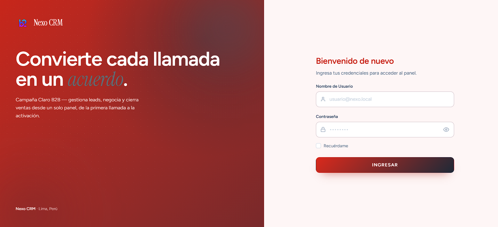
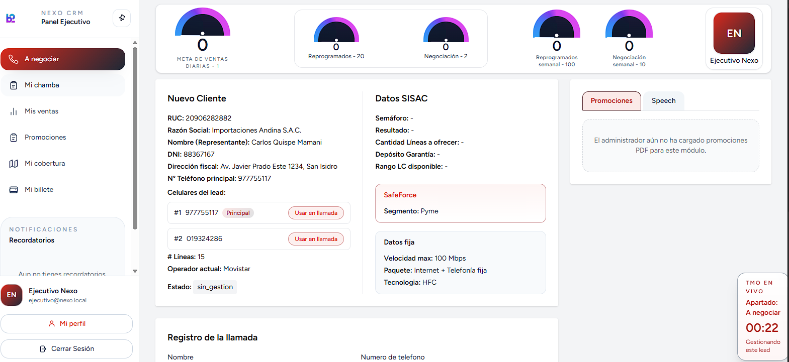
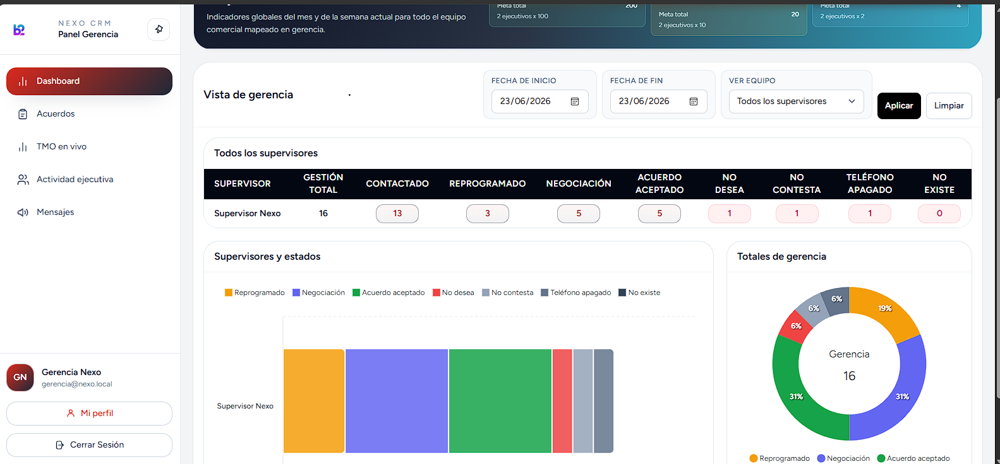

# Nexo CRM

**CRM de call center para venta B2B de telecomunicaciones.** Gestiona el ciclo completo de una venta corporativa: desde la captación del lead hasta la activación del servicio, con roles diferenciados, dashboards en tiempo real y un pipeline de validación de varias etapas.


> Proyecto personal de portafolio que modela el flujo operativo real de un call center de ventas.

---

## 🔄 El pipeline de venta

```
Lead → Contacto → Negociación → Acuerdo → Validación Supervisor → Mesa de Control → Entrega / Activación
```

Cada etapa la opera un rol distinto, con su propia bandeja, reglas de negocio y métricas.

## ✨ Características principales

- **Reparto automático de leads** — bolsa de clientes por campaña con asignación 1‑a‑1, liberación automática por no‑contacto y deshabilitación de un lead tras pasar por 3 ejecutivos sin éxito.
- **Módulo "A negociar"** — speech de venta guiado por tipo de cliente (accesible / intermedio / difícil), registro de gestiones y armado de ofertas (portabilidad y alta nueva, producto móvil y/o fijo).
- **Acuerdos** — captura del acuerdo aceptado con adjuntos del cliente (contratos, DNI) almacenados de forma **privada** y servidos solo con autorización.
- **Validación en cascada** — Supervisor valida → Mesa de Control gestiona SISAC, activaciones y entrega.
- **Dashboards en tiempo real** — Gerencia y Supervisor con metas diarias/semanales, TMO en vivo y monitoreo de actividad de los ejecutivos.
- **Cobertura territorial** — mapas interactivos (Leaflet) con configuración por provincia.
- **Promociones** — gestión de PDFs y nombres de promociones con precios.
- **Mensajería interna** entre roles, módulos de **RRHH** (formularios) y **MKT** (frases).
- **Actualización en vivo sin recargar** — endpoints de *polling* (`*/pulse`) que devuelven JSON.
- **Personalización por usuario** — tema de color configurable y modo claro/oscuro.

## 👥 Roles del sistema (9)

| Rol | Pantalla principal |
|---|---|
| Ejecutivo | A negociar |
| Supervisor | Validación de acuerdos |
| Mesa de Control | Validación / activaciones |
| Gerencia | Dashboard |
| Postventa | Gestión postventa |
| RRHH | Formularios |
| MKT | Frases |
| Administrador de promociones | Promociones |
| Administrador | Panel admin |

Permisos gestionados con **Spatie Laravel Permission**.

## 🛠️ Stack tecnológico

- **Backend:** Laravel 12 · PHP 8.4
- **Base de datos:** MariaDB 11.4 · Redis (caché)
- **Frontend:** Blade · Alpine.js · Tailwind CSS · Vite
- **Mapas:** Leaflet
- **Infraestructura:** Docker (nginx · php‑fpm · mariadb · redis)
- **Calidad:** PHPUnit (73 tests feature) · Laravel Pint · GitHub Actions (CI)

## 📸 Capturas







## 🚀 Instalación (Docker)

> Requisito: solo **Docker** y **Docker Compose**. No necesitas PHP ni Node instalados en tu máquina.

```bash
# 1. Clonar
git clone https://github.com/JEHL22/nexo-crm.git
cd nexo-crm

# 2. Variables de entorno
cp .env.example .env
#   En .env, para desarrollo local ajusta:
#     APP_ENV=local
#     APP_DEBUG=true
#     SEED_DEMO_USERS=true   (crea los usuarios de demo)

# 3. Levantar contenedores (nginx, php-fpm, mariadb, redis)
docker compose up -d

# 4. Dependencias y key de la app
docker compose exec app composer install
docker compose exec app php artisan key:generate

# 5. Migraciones + datos base (roles, campañas, usuarios demo)
docker compose exec app php artisan migrate --seed

# 6. Datos de demo para "A negociar" (20 leads + equipo)
docker compose exec app php artisan db:seed --class=DemoLeadsSeeder

# 7. Compilar el frontend
docker compose run --rm node npm install
docker compose run --rm node npm run build
```

App disponible en **http://localhost:8080**

## 🔑 Usuarios de demo

| Rol | Email | Contraseña |
|---|---|---|
| Administrador | `admin@nexo.local` | `Nexo` |
| Gerencia | `gerencia@nexo.local` | `Nexo` |
| Supervisor | `supervisor@nexo.local` | `Nexo` |
| Ejecutivo | `ejecutivo@nexo.local` | `Nexo` |
| Postventa | `postventa@nexo.local` | `Nexo` |
| Mesa de Control | `mesa@nexo.local` | `Nexo` |

## 🧪 Tests

```bash
docker compose exec app php artisan test
```

La suite (sqlite en memoria) corre también en **GitHub Actions** en cada push/PR.

## 🧱 Notas de arquitectura

- **Escalabilidad:** las listas grandes cargan solo con conteos/agregados; el detalle se pide on‑demand por AJAX (evita N+1 con batching).
- **Convenciones:** validación inline en controladores, autorización por rol, operaciones multi‑tabla en transacciones, lógica compartida en clases estáticas (`app/Support/`).
- **Migraciones idempotentes** para soportar entornos divergentes.
- **Tiempo real sin websockets:** polling ligero vía endpoints `*/pulse` con *throttle*.

---

*Construido con Laravel + Docker.*
